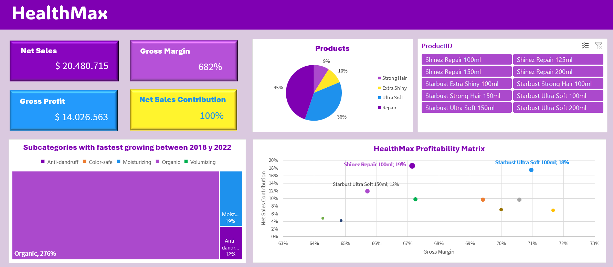
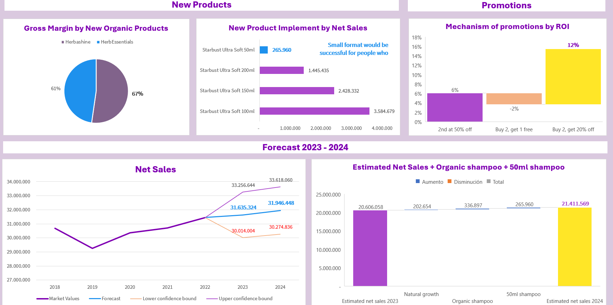

# HealthMax - Revenue Growth Analysis (Excel)

## Overview
HealthMax is a supplier in FMCG (Fast-Moving Consumer Goods) operating in the shampoo market.
The main goal of this project was to identify growth opportunities through Net Revenue Management (NRM), analyzing the performance of its two key brands: Shinez and Starbust.

## 🎯Business Questions
- Which subcategories and products show the highest growth potential?
- What is the profitability of each brand and product in terms of Net Sales and Gross Margin?
- Which promotion mechanisms deliver the highest ROI?
- What opportunities exist for new launches and packaging sizes?
- What is the Net Sales forecast for 2023 and 2024?

## 💡Analysis
- Net Sales and Gross Margin were analyzed across internal products.
- Performance of subcategories was evaluated between 2018 and 2022 to identify the fastest-growing.
- A forecast model projected for 2023-2024.
- Promotion ROI was calculated for different discount strategies.
- Estimated 2024 Net Sales included natural growth, organic shampoos, and the launch of a new small-sized product.

## ✅Results
- **Organic** was the fastest-growing subcategory, with 276% growth between 2018 and 2022.
- Within this subcategory, **Herbashine** showed the highest Gross Margin (67%), making it the most profitable product to focus on.
- Promotion analysis highlighted **Buy 2, get 20% off** as the best-performing mechanism with **12% ROI**
- A new market opportunity was identified and its Net Sales: **Starbust Ultra Soft 50ml**
- The **Net Sales Forecast** shows stable growth toward 2024, reaching an estimated $21.4M

## Visualization

